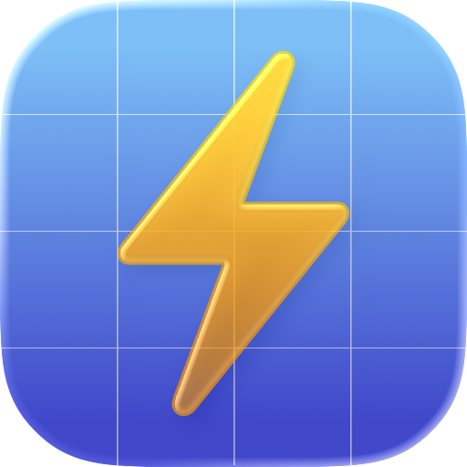

<!--
README.md — written to be both human-friendly on GitHub and learning-friendly
for AI assistants opening the repo. The HTML below renders on github.com.
-->

<p align="right">
  <b>English</b> ·
  <a href="README-zh_cn.md">简体中文</a> ·
  <a href="README-zh_tw.md">繁體中文</a>
</p>

> **Built with AI, directed by a human.**
> Relay is developed end-to-end with AI coding assistants; the developer acts as **creative director and QA**.
> `AGENTS.md`, `CLAUDE.md`, and the `.trellis/` workflow folder are committed **on purpose** — this is a learning project. Read them, fork them, send PRs.

<br />

<p align="center">
  
</p>

<h1 align="center">Relay</h1>

<p align="center">
  A native macOS global app switcher — Thor-like —<br/>
  with scene-based <b>Profiles</b> of global hotkeys, living in the menu bar.
</p>

<p align="center">
  <a href="https://github.com/is52hertz/Relay/releases/latest"></a>
  <a href="https://github.com/is52hertz/Relay/releases"></a>
  
  
  
  
</p>

<p align="center">
  <a href="https://github.com/is52hertz/Relay/releases/latest"><b>⬇️ Download the latest .dmg</b></a>
</p>

---

## What is Relay?

Relay is a native macOS global **application switcher**, in the spirit of Thor. You bind a
global hotkey to a target app, and that hotkey launches, focuses, hides, or returns you to your
previous app — depending on the app's current state. Bindings are grouped into **Profiles**
(e.g. *Coding*, *Design*, *Writing*), so you can swap a whole set of hotkeys per workflow with
one switch. Only the active Profile's hotkeys are ever registered.

It is a small, single-user **menu-bar agent** with a local dataset. Everything stays on your
Mac: **no accounts, no network, no telemetry**. It runs un-sandboxed (it controls other apps),
is signed with a personal Apple Development certificate, and is built for local / self-use —
**not** the Mac App Store.

---

## ✨ Features

- 🗂️ **Scene-based Profiles (hotkey groups)** — group your bindings by workflow and switch the
  whole set at once. At any moment, only the **active Profile** has its hotkeys registered.
- ⌨️ **Global hotkeys** — registered through Carbon `RegisterEventHotKey` (via the
  [`KeyboardShortcuts`](https://github.com/sindresorhus/KeyboardShortcuts) package). The hotkeys
  themselves need **no Accessibility / Input Monitoring permission**. The built-in recorder
  temporarily disables global hotkeys while you record so the combo gets captured instead of
  fired. Duplicate combos within a Profile are detected and badged.
- 🎯 **State-aware activation behaviors** — a behavior is a named, reusable mapping from the
  target app's runtime state to an action. Bindings reference a behavior by name; edit the
  behavior once and every binding that uses it updates.

  | Target app state | Available actions |
  |---|---|
  | **Not running** | Launch & Focus · Launch in Background · Do Nothing |
  | **Running in background** | Focus · Show Without Focus · Minimize |
  | **Currently frontmost** | Return to Previous · Hide · Quit · Minimize · Do Nothing |

- 🔁 **Return to Previous** — when the target is already frontmost, Relay flips you back to the
  app you were just in (depth-2 MRU, like ⌘-Tab), tracked by observing app-activation events.
- 🧩 **Public AppKit only for controlling other apps** — `NSWorkspace.openApplication` to
  launch / focus / return-to-previous, and `NSRunningApplication.hide() / unhide()` to hide and
  show. No private APIs, no event taps.
- 🪟 **Management window** — a Profiles sidebar (keyboard navigation, inline rename, active
  highlight), binding details, and global-shortcut recording.
- 📋 **Menu-bar agent** — lives in the menu bar; an optional Dock icon can be toggled on.
- ⚙️ **Settings** — *General* (launch at login via `SMAppService`, show Dock icon) and
  *Personalization* (interface language: Follow System / 简体中文 / 繁體中文 / English — applied
  after a restart).
- 🪟 **Optional Minimize via Accessibility** — minimizing a target's window is a gated capability
  that requests Accessibility **lazily, on first use, never at launch**. Without the permission
  the app stays fully usable; only Minimize degrades safely with a one-time notice.

---

## 💻 Requirements

- **Apple Silicon** Mac
- **macOS 26.5 or later**

---

## 📦 Install

1. Download `Relay-vX.Y.Z.dmg` from [Releases](https://github.com/is52hertz/Relay/releases/latest) and open it.
2. Drag **Relay** into **Applications**.
3. **First launch (important).** This build is signed with a personal Apple Development
   certificate and is **not notarized**, so Gatekeeper will block it. **Right-click** the app →
   **Open** → **Open**. If it is still refused, run this once in Terminal:
   ```sh
   xattr -dr com.apple.quarantine /Applications/Relay.app
   ```

---

## 🚀 Usage

- Relay lives in the **menu bar**. Open the menu and choose to open the **management window**.
- In the window, **create a Profile**, add a target app to it, then **record a global hotkey**
  for that binding and pick (or create) an **activation behavior**.
- Trigger your hotkey anywhere — Relay launches / focuses / hides / returns based on the target
  app's current state.
- **Switch Profiles** to swap the whole active hotkey set for a different workflow.
- Change the **interface language** in **Settings › Personalization** (the app restarts to apply).
- Toggle **Launch at login** and the **Dock icon** in **Settings › General**.

---

## 🛠 Build from source

**Requirements:** Xcode 26 on a macOS 26.5+ host (Apple Silicon).

```sh
git clone https://github.com/is52hertz/Relay.git
cd Relay
open Relay/Relay.xcodeproj      # open in Xcode 26, then ⌘R
```

Or from the command line:

```sh
xcodebuild -project Relay/Relay.xcodeproj -scheme Relay -configuration Release -destination 'generic/platform=macOS' build
```

> The **App Sandbox is intentionally off** (`ENABLE_APP_SANDBOX = NO`) because Relay launches and
> activates arbitrary other apps. Hardened Runtime is on; it ships as a menu-bar agent
> (`LSUIElement = YES`).

---

## 🔐 Permissions

- **Global hotkeys need no special permission.** They go through Carbon `RegisterEventHotKey` —
  no Accessibility, no Input Monitoring, no `CGEventTap`, no global event monitors.
- **Minimize is the only gated feature.** It uses Accessibility and requests it **lazily, the
  first time you actually use it** — never at launch. The app remains fully functional without
  the grant; only Minimize is unavailable, and it degrades safely with a one-time notice.

---

## 🕵️ Privacy

No network, no accounts, no telemetry. Your configuration — a few Profiles and bindings — is
stored locally as Codable JSON in Application Support (atomic, debounced writes). Nothing ever
leaves your Mac.

---

## 🤖 AI-native development

This repo is a worked example of **AI-native development**. The context an assistant needs is
checked in **on purpose**:

| File / Folder | Purpose |
|---|---|
| `AGENTS.md` | **Source of truth** — product rules, coding standards, scope discipline, commit policy. |
| `CLAUDE.md` | Per-tool entrypoint (a symlink to `AGENTS.md`). |
| `.trellis/` | Task workflow: PRDs, specs, and per-task context that drove each change. |

> Built with AI, directed by a human. Read the files, fork the repo, and study how it was made.

---

## 📜 License

Released under the **GNU General Public License v3.0** (GPL-3.0).

> Why GPL? This project exists to teach. GPL ensures that derivatives — including AI-generated
> forks — stay open so the next learner can study them too. If you build on it, share it back.

Copyright (C) 2026 Teethe. See [`LICENSE`](LICENSE) for the full text.
